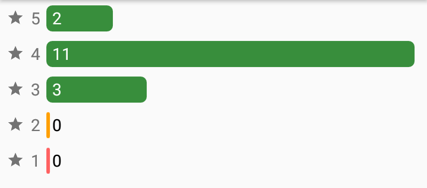

# Rating Summary

A rating summary view similar to google play stores




Getting started
-------------------
These instructions will get you a copy of the project, up and running on your local machine for development and testing purposes. See deployment for notes on how to deploy the project on a live system.

Installing
-------------------
Refer the library in an Android application project in the app/build.gradle as follows:

```bash
dependencies {
    compile 'com.krixi.ratingsummary:RatingSummary:1.0.0'
}
```

Usage in layout xml
-------------------
You can add the following snipate in xml file

```bash
   <com.krixi.ratingsummary.RatingSummary
        android:id="@+id/summaryContainer"
        android:layout_width="match_parent"
        android:layout_height="match_parent"
        android:orientation="vertical"

        custom:star1SummaryColor="@color/red_rating"
        custom:star2SummaryColor="@color/orange_rating"
        custom:star3SummaryColor="@color/green_rating"
        custom:star4SummaryColor="@color/green_rating"
        custom:star5SummaryColor="@color/green_rating"

        custom:starsSummaryCountDefaultColor="@color/white"
        custom:starsSummaryCountZeroValueDefaultColor="@color/black">

    </com.krixi.ratingsummary.RatingSummary>
```

Required attribute
-------------------
  Orientation is required

Optional attribute
-------------------
  You can change the color of each summary bar or the number of rating with following optional paramters. If no information is provided then default colors will be used.
  
```bash
custom:star1SummaryColor
custom:star2SummaryColor
custom:star3SummaryColor
custom:star4SummaryColor
custom:star5SummaryColor
custom:starsSummaryCountDefaultColor
custom:starsSummaryCountZeroValueDefaultColor
custom:star1SummaryCountColor
custom:star2SummaryCountColor
custom:star3SummaryCountColor
custom:star4SummaryCountColor
custom:star5SummaryCountColor
custom:star1SummaryCountZeroValueColor
custom:star2SummaryCountZeroValueColor
custom:star3SummaryCountZeroValueColor
custom:star4SummaryCountZeroValueColor
custom:star5SummaryCountZeroValueColor
```

They take color as a input.

Usage in activity
-------------------
  1. Initailize the view
  
  ```bash
  RatingSummary summary = (RatingSummary) findViewById(R.id.summaryContainer);
  ```
  
  2. Assign the json containing the rating for starts to rating view
  
  ```bash
  summary.setStarValues(starValues);
  ```  
  
  3. Invoke the draw method to render the rating
  
  ```bash
  summary.drawRatingSummary();
  ```
  
  Sample 
  
  ```bash
  JSONObject starValues = new JSONObject("{\"1\": 0, \"2\": 0, \"3\": 3, \"4\": 11, \"5\": 2}");
  RatingSummary summary = (RatingSummary) findViewById(R.id.summaryContainer);
  summary.setStarValues(starValues);
  summary.drawRatingSummary();
  ```
  
  


